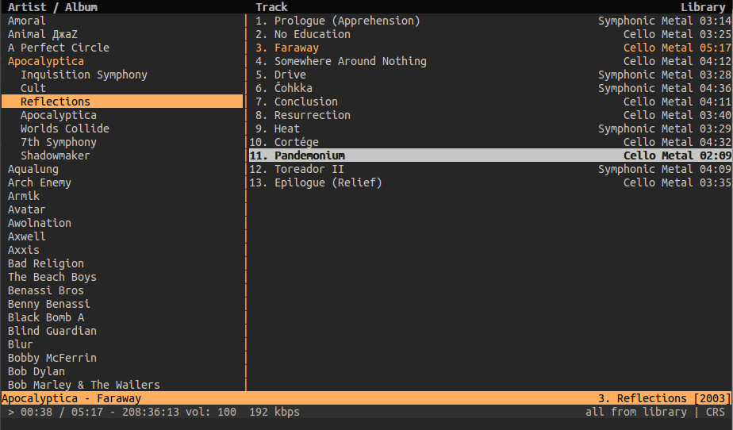

# Yowish - <small>A dark & yellowish cmus colorscheme</small>

Description
-----------

A theme for [cmus](https://cmus.github.io/) based on [yowish.vim](https://github.com/kabbamine/yowish.vim).

Installation
-----------

Drop it in your `~/.cmus/` then load it using `:colorscheme yowish`.

License
--------

MIT

